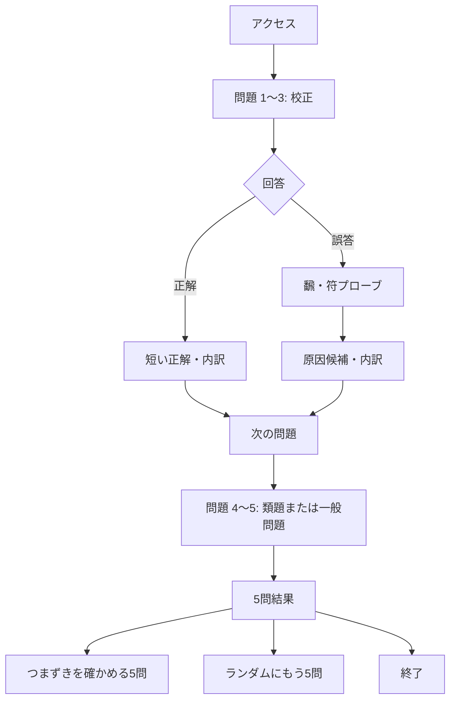
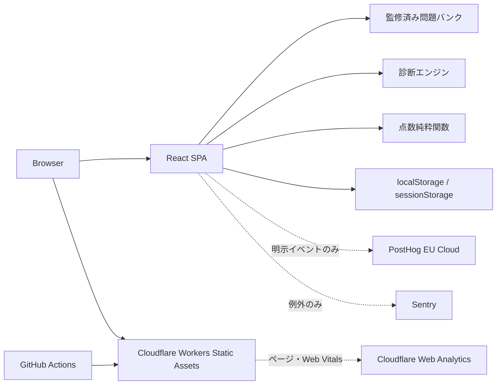

# 「この手、何点？」プロダクト・技術設計書

| 項目 | 内容 |
|---|---|
| 文書状態 | PM承認済み |
| バージョン | 1.0.0 |
| 作成日 | 2026-09-03 |
| 最終レビュー | 2026-09-03 / Growth PM（Sol high）/ APPROVE |
| 対象 | MVPから公開β、初期運用まで |
| 想定読者 | PM、デザイナー、フロントエンド開発者、問題作成者、運用担当 |

## 0. この文書の使い方

この文書は、空のリポジトリから実装・公開・保守できる水準の意思決定をまとめたものとする。実装時に判断が割れた場合は、次の優先順位で決める。

1. 点数と解説の正確性
2. 開いてすぐ答えられること
3. 誤診しないこと
4. 5問で気持ちよく終われること
5. 保守対象を増やさないこと
6. 将来のグロース施策を妨げないこと

この順序を変える変更はADR（Architecture Decision Record）を追加し、PMと麻雀ルール監修者の承認を得る。

---

## 1. エグゼクティブサマリー

### 1.1 プロダクトの一文

> **この手、何点？**  
> 5問で、いま引っかかっている計算の1点がわかる。

### 1.2 提供価値

オンライン麻雀で和了形や役はおおむね分かるが、実卓で点数を申告する自信がない人に向けて、実戦形式の牌姿を5問提示する。利用者は毎回「最終的に何点か」だけを答える。誤答した場合だけ飜数・符数を追加で確認し、誤りの場所を切り分ける。残りの問題に類題を差し込み、同一セッション内で理解できたか確認する。

### 1.3 差別化

差別化は「5問」でも「苦手記録」でもない。

> **実戦と同じ最終点数の回答を保ちつつ、誤答時だけ最小限の追加操作で計算過程を切り分け、その場の類題で確認まで終えること。**

### 1.4 MVPの制約

- Webのみ。iOS、Android、Electron、Tauriの専用アプリは作らない。
- ログイン、アカウント、サーバー保存を作らない。
- タイマー、ストリーク、ランキング、XP、段位を作らない。
- 起動時の説明、モード選択、難易度選択を置かない。
- 問題は自動生成せず、監修済みの問題バンクから出す。
- AIで採点・診断しない。決定論的なルールで処理する。
- 「恒久的な苦手」を5問で断定しない。

---

## 2. 対象利用者と課題

### 2.1 プライマリーペルソナ

| 項目 | 内容 |
|---|---|
| 麻雀経験 | 雀魂、天鳳、MJ等のオンライン麻雀を継続して遊んでいる |
| できること | 基本ルール、和了形、主要な役は分かる |
| 困りごと | 符計算、飜数合計、点数表への変換、親子・ロンツモの支払いで止まる |
| 行動 | 普段は自動計算に任せるため、実卓で申告できない |
| 動機 | 勉強を習慣化したいほどではないが、暇な数分なら試したい |
| 利用端末 | スマートフォン中心。PCも対応する |

### 2.2 対象外

- 麻雀のルールをまったく知らない人
- 上級者向けの競技ルール差を比較したい人
- 三人麻雀だけを遊ぶ人
- 実卓の手牌を入力して計算機として使いたい人
- 長期カリキュラムや資格学習のような進捗管理を求める人

### 2.3 JTBD

> 麻雀を打っていない短い時間に、実戦に近い手牌の点数を答え、自分が計算のどこで止まったかをすぐ理解したい。

### 2.4 利用シーン

- 電車や待ち時間に1セットだけ解く。
- 実卓へ行く前に計算感覚を確認する。
- オンライン対局後、点数申告ができるか試す。
- 麻雀仲間からURLを送られ、同じ5問に挑戦する（MVP後）。

---

## 3. プロダクト原則

1. **入口は問題である。** トップページを開いた時点で1問目を表示する。
2. **表向きは腕試し、裏側は学習。** 「授業」「宿題」「今日の目標」を使わない。
3. **全問を実戦形式に統一する。** 最初に答えるのは常に最終点数とする。
4. **正解者を止めない。** 追加確認は誤答時だけ出す。
5. **分からないことを正直に返す。** 証拠不足なら診断不能とする。
6. **利用しない日を負債にしない。** 未利用日、連続日数、期限を表示しない。
7. **問題品質を機能数より優先する。** 正解が疑われる問題は公開しない。
8. **端末内保存を前提にする。** 消える可能性と削除方法を明示する。

---

## 4. 成功条件と検証仮説

### 4.1 North Star Metric

**週あたり「役に立った」と評価された5問完了セッション数**を中心指標とする。

```text
Weekly Helpful Completed Sessions
= session_completed
  AND diagnosis_feedback_submitted(answer="yes")
```

結果画面では「今回の結果は役に立ちましたか？ [はい] [いいえ]」を任意で聞く。未回答を「はい」に含めない。回答率が低い間は、完了セッション数、有用度回答率、回答者中の「はい」の割合を必ず併記する。登録ユーザー数、PV、連続日数はNorth Starにしない。

### 4.2 公開βの主要指標

| 指標 | 定義 | 初期目標 | 意味 |
|---|---|---:|---|
| 5問完了率 | `session_completed / session_started` | 65%以上 | 入口と5問の負担が適切か |
| 1問目回答率 | `answer_submitted(slot=1) / session_started` | 85%以上 | 即開始が成立しているか |
| 誤答後プローブ完了率 | `probe_completed / probe_shown` | 70%以上 | 追加確認が重すぎないか |
| 類題到達率 | `followup_answered / followup_scheduled` | 80%以上 | 診断ループが完了しているか |
| 類題改善率 | 対象タグを誤答後、類題で正解した割合 | 基準値を計測 | 学習仮説が成立するか |
| 即時再挑戦率 | 結果画面からもう5問を開始した割合 | 20%以上 | 再プレイ価値があるか |
| 診断有用度回答率 | `diagnosis_feedback_submitted / session_completed` | 40%以上 | 評価母数が十分か |
| 診断有用率 | `helpful=yes / diagnosis_feedback_submitted` | 70%以上 | 診断が価値として受け取られたか |
| 問題報告率 | 問題への報告件数 / 表示回数 | 0.3%未満 | 正確性・表現品質 |

目標値は公開βの仮説であり、200完了セッション未満では大きな機能判断に使用しない。

### 4.3 MVPで答える問い

1. 説明なしで牌姿と選択肢を理解できるか。
2. 5問なら最後まで解かれるか。
3. 誤答時の追加確認を利用者が受け入れるか。
4. 「今回のつまずき」が納得できるか。
5. 類題で正解できた体験が、再挑戦につながるか。

### 4.4 対象利用者テストと実装ゲート

診断ロジックを64問へ展開する前に、プライマリーペルソナ5〜8人でモデレーテッドテストを行う。参加者にはURLだけを渡し、初回理解、回答操作、プローブ負担、診断の受け取り方、再挑戦意向を観察する。

次をすべて満たすまで64問制作へ進まない。

- 5人なら4人以上、6〜8人なら80%以上が、説明なしで開始し介助なしで完了する。
- 同じ人数が、結果を恒久的な能力断定ではなく「今回の5問」と理解する。
- 70%以上が結果を「役に立った」と回答する。
- ロン・ツモ、親・子、和了牌の誤読が20%未満。
- 正解点、牌姿、ルールに関する重大な疑義が0件。

### 4.5 公開βの継続・停止ゲート

200完了セッション時点で、完了率65%以上、プローブ完了率70%以上、有用度回答率40%以上、有用率70%以上、問題報告率0.3%未満、SEV1採点誤り0件なら問題追加へ進む。

次のいずれかなら新規集客と問題拡張を止めて再設計する。

- 2回の単一要因UI改善後も完了率またはプローブ完了率が50%未満。
- 有用度回答30件以上で「はい」が50%未満。
- 異なる利用者から同じ誤診報告が3件以上。
- 30日以内にSEV1の採点誤りが2件以上。
- 能力を断定されたと誤解するテスト参加者が20%以上。

プローブだけが弱ければ質問を減らし、全体完了だけが弱ければ牌姿・選択肢・解説量を見直す。両方が弱ければ、診断なしの点数当て版と比較する。一度に複数要因を変えない。

---

## 5. ルールセット

### 5.1 基本方針

MVPは四人打ちリーチ麻雀の一つの固定ルールだけを扱う。ルール差が結果へ影響する問題は原則として出さない。採点仕様の一次資料には[Mリーグ公式戦ルール](https://m-league.jp/about/)の得点計算部分を用い、MVP固有の除外事項を本節で上書きする。Mリーグとの提携・公認を示す表現は使わない。

### 5.2 採用する計算

- 四人打ち。
- 親・子を区別する。
- ロン・ツモを区別する。
- 門前・副露を区別する。
- 喰いタンあり。
- 赤5萬・赤5筒・赤5索を各1枚とする。
- ドラ、裏ドラ、赤ドラは画面上に明示する。
- 副底20符、門前ロン10符、ツモ2符を扱う。
- 面子、雀頭、待ちの部分符を扱う。
- 符は合計後、10符単位に切り上げる。
- 七対子は25符固定。
- 平和ツモは20符、平和ロンは30符。
- 満貫、跳満、倍満、三倍満、役満を扱う。
- 最終支払いは100点単位に切り上げる。

### 5.3 MVPで出題しないもの

- 三人麻雀。
- 本場、供託、順位点、ウマ、オカ。
- 切り上げ満貫が採否に影響する3飜60符・4飜30符。
- 連風牌雀頭の符が結果に影響する問題。
- 数え役満、ダブル役満、責任払い。
- 国士無双、四槓子、天和、地和（MVPの手牌・局進行モデルで完全検証しないため）。
- 流し満貫、人和、ローカル役。
- 複数の和了解釈で診断対象が変わる牌姿。
- 高点法の解釈が監修者間で割れる牌姿。

### 5.4 画面表記

問題画面には「四人打ち・本場なし」を短く表示し、詳細は`/rules`へリンクする。ルール変更時は`rulesetVersion`を更新し、既存問題を全件再検証する。

---

## 6. 診断モデル

### 6.1 診断の限界

最終点数の誤答だけでは原因を断定できない。同じ誤答点は、役の見落とし、飜合計、符、点数表、親子の読み違いなどから発生しうる。そのため、問題タグだけで「苦手」と判定してはならない。

本サービスが返すものは「恒久的な能力診断」ではなく、**今回の5問で確認できたつまずき**である。

### 6.2 表示分類と内部タグ

結果の主分類は`han`（役・飜）、`fu`（符）、`payout`（点数変換・支払い条件）の3つだけとする。5問では細分能力を断定できないためである。`yaku.presence`、`han.value`、`han.dora`、`fu.wait`、`fu.pair`、`fu.meld`、`fu.win`、`fu.rounding`、`special.pinfu`、`special.chiitoitsu`、`context.seat`、`context.winMethod`、`payout.table`、`payout.limit`は、類題検索と説明文だけに使う。

### 6.3 証拠は異なる問題単位で数える

同じ問題内の最終回答、誤答肢、飜プローブ、符プローブは、合わせて一つの観測とする。誤答肢とプローブを別証拠として加算してはならない。

```ts
type CoarseDiagnosis = "han" | "fu" | "payout";
type DiagnosticObservation = {
  problemId: string;
  slot: 1 | 2 | 3 | 4 | 5;
  role: "calibration" | "followup" | "general";
  followupFor?: CoarseDiagnosis;
  finalAnswerCorrect: boolean;
  diagnosticUseful: boolean;
  coarseDiagnosis?: CoarseDiagnosis;
  fineCandidates: string[];
  unusableReason?: "question-ineligible" | "probe-skipped" |
    "probe-incomplete" | "multiple-stages-wrong" | "ambiguous-option";
};
```

誤答問題の分類は次に固定する。

| 最終点数 | 飜プローブ | 符プローブ | 有用 | 分類 |
|---|---|---|---:|---|
| 正解 | 不要 | 不要 | 類題の成否確認だけに有用 | なし |
| 誤答 | 正解 | 正解 | Yes | `payout` |
| 誤答 | 誤答 | 正解 | Yes | `han` |
| 誤答 | 正解 | 誤答 | Yes | `fu` |
| 誤答 | 誤答 | 誤答 | No | 複数段階 |
| 誤答 | 分からない/未回答 | 任意 | No | 証拠不足 |
| 誤答 | 任意 | 分からない/未回答 | No | 証拠不足 |
| 誤答 | 診断対象外 | 診断対象外 | No | 対象外 |

満貫以上など符の回答が原因分離に寄与しない問題は`diagnosis.eligible=false`とし、校正・類題に用いない。誤答肢はプローブ候補と説明には使うが、それだけで分類を確定しない。

### 6.4 強い診断と結果の決定表

「今回のつまずき」は、1〜3問目の診断有用な失敗と、その分類を確認するために計画配置した**異なる問題IDの類題**で、同じ粗分類の診断有用な失敗が再現した場合だけ表示する。一問の誤答とプローブ、校正問題同士の偶然の一致、一般問題での一致からは確定しない。

記号は`I-(A)`=初期問題でAの有用な失敗、`F-(A)`=A用類題でAの有用な失敗、`F+(A)`=A用類題に正解、`F?(A)`=類題が診断不能、`G-(A)`=一般問題の失敗とする。

| 初期問題 | 後半 | 結果kind | 主表示 |
|---|---|---|---|
| 全問正解 | なし | `clear` | 今回はつまずきなし |
| 有用な失敗なし | 任意 | `unknown` | 今回は特定できず |
| `I-(A)` | 類題なし/`F?(A)` | `candidate` | Aは今回の見直し候補 |
| `I-(A)` | `F+(A)` | `repaired` | 別の問題では修正できた |
| `I-(A)` | `F-(A)` | `confirmed` | 今回はAで2回つまずいた |
| `I-(A)` | `F-(B)` | `unknown` | 初期問題と類題で原因候補が分かれ、特定不能 |
| `I-(A), I-(B)` | `F-(A)` | `confirmed` | Aを主表示 |
| `I-(A), I-(B)` | `F+(A)` | `candidate` | Bを候補、Aは修正済みと補足 |
| `I-(A), I-(A)` | 類題なし | `candidate` | 初期問題だけなので候補 |
| 初期失敗なし | `G-(A)`が1件以上 | `candidate` | Aは候補 |
| 複数分類が同順位 | 確認成功なし | `unknown` | 候補が複数 |

結果型は`clear | candidate | repaired | confirmed | unknown`の5つ。利用者へ「あなたは苦手」とは表示しない。

### 6.5 5問の決定的な出題アルゴリズム

1〜3問目は`fu`、`han`、`payout`の校正問題をseed付きでシャッフルする。初回の1問目はbasic。3問目終了後、診断有用な失敗を粗分類ごとに**異なる問題ID数**で数え、最多が一つならそれを、同点なら最初に出た分類を4問目の類題対象にする。同点解消は出題のためだけであり診断確定ではない。候補がなければ4〜5問目を一般問題にする。

4問目が同分類の有用な失敗なら5問目も同分類の別サブタイプ、正解または診断不能なら5問目は一般問題とする。問題不足時は一般問題へフォールバックし、`confirmed`は作らない。同一seed、問題バンクversion、回答列からは、常に同一の出題列と結果を返す。

```ts
function chooseFollowup(observations: DiagnosticObservation[]) {
  const groups = groupUsableCalibrationFailuresByCategory(observations);
  if (groups.length === 0) return { kind: "general" as const };
  const max = Math.max(...groups.map(g => g.uniqueProblemIds.size));
  const top = groups.filter(g => g.uniqueProblemIds.size === max)
    .sort((a, b) => a.firstSlot - b.firstSlot);
  return { kind: "followup" as const, category: top[0].category,
    wasTied: top.length > 1 };
}

function isConfirmed(initial: DiagnosticObservation, followup: DiagnosticObservation) {
  return initial.problemId !== followup.problemId &&
    initial.role === "calibration" && !initial.finalAnswerCorrect &&
    initial.diagnosticUseful &&
    followup.role === "followup" && !followup.finalAnswerCorrect &&
    followup.diagnosticUseful &&
    followup.followupFor === initial.coarseDiagnosis &&
    followup.coarseDiagnosis === initial.coarseDiagnosis;
}

type ResultKind = "clear" | "candidate" | "repaired" | "confirmed" | "unknown";
type SessionSummary = {
  kind: ResultKind;
  primary?: CoarseDiagnosis;
  repairedSecondary?: CoarseDiagnosis;
  reason?: "insufficient" | "tie";
};

function summarize(observations: DiagnosticObservation[]): SessionSummary {
  assert(observations.length === 5);
  if (observations.every(o => o.finalAnswerCorrect)) return { kind: "clear" };

  const followup = observations.find(o => o.role === "followup" && o.followupFor);
  const target = followup?.followupFor;
  const initialTarget = target && observations.find(o =>
    o.role === "calibration" && o.problemId !== followup!.problemId &&
    !o.finalAnswerCorrect && o.diagnosticUseful && o.coarseDiagnosis === target);

  // 計画類題の成否を最優先で確定する。
  if (followup && target && initialTarget && isConfirmed(initialTarget, followup)) {
    return { kind: "confirmed", primary: target };
  }
  const repaired = Boolean(followup && target && initialTarget && followup.finalAnswerCorrect);

  // 修正確認済みtargetを除き、未確認の有用な失敗を問題ID単位で集約する。
  const groups = groupUsableFailures(observations, {
    excludeCategory: repaired ? target : undefined,
    excludeCorrect: true,
  });
  if (groups.length > 0) {
    const max = Math.max(...groups.map(g => g.uniqueProblemIds.size));
    const top = groups.filter(g => g.uniqueProblemIds.size === max);
    if (top.length === 1) return { kind: "candidate", primary: top[0].category,
      repairedSecondary: repaired ? target : undefined };
    return { kind: "unknown", repairedSecondary: repaired ? target : undefined,
      reason: "tie" };
  }
  if (repaired) return { kind: "repaired", primary: target };
  return { kind: "unknown", reason: "insufficient" };
}
```

5問目の一般問題で新しい分類の失敗が出た場合も、上記の未確認集合に含める。計画類題で分類がtargetと違う失敗はtargetを確定せず、その実測分類も未確認集合に含めるため、両者同数なら`unknown/reason="tie"`になる。これにより`I-(A) + F-(B)`は表・本文・実装の全てで`unknown`となり、任意の有効な5観測から必ず一つだけ結果が返る。決定表の全行、同点、問題不足、複数誤答をtable testにし、1,000 seedで結果なし・複数結果・例外・不正な`confirmed`が0件であることを検証する。

### 6.6 問題固有のプローブ

正解時は出さない。誤答時は最大2グループ、各3〜5数値＋「分からない」を同一パネルに出す。正解を見せる前に回答させる。全体を飛ばす「今回は答えない」も置く。

```ts
type ProbeDefinition = {
  han: { correct: number; options: number[] };
  fu: { correct: number; options: number[] };
  allowUnknown: true;
};
const VALID_FU = [20, 25, 30, 40, 50, 60, 70, 80, 90, 100, 110];
```

共通の固定配列は使わない。正解値、監修済み誤答肢の`assumedHan`/`assumedFu`を優先し、不足分を正解に近い有効値で埋める。重複・0飜・負数・無効符を禁止し、正解を必ず一つ含める。25符は七対子関連時だけ。生成結果はビルド時に確定し、作者と監修者がPR previewで確認する。

### 6.7 最終点数の選択肢

4択とする。正解1つと自然な誤計算3つを問題データで監修し、実行時はseedで順序だけを変える。各誤答肢には`assumedHan?`、`assumedFu?`、粗分類、細分仮説を持たせる。Paymentのcanonical keyが全て異なることを検証する。

---

## 7. 問題バンク

### 7.1 方針

MVPでは人間が作成・監修した64問をリポジトリで管理する。完全ランダム生成、CMS、ユーザー投稿は行わない。最大の運用リスクは問題の正解が誤っていることであり、公開速度より二重検証を優先する。

### 7.2 最低問題数

| 分類 | 問題数 |
|---|---:|
| 役・飜・ドラ | 10 |
| 待ち符 | 8 |
| 雀頭符 | 6 |
| 刻子・槓子符 | 10 |
| 和了方法の符 | 6 |
| 符切り上げ・平和・七対子 | 8 |
| 親子・ロンツモ・点数表 | 10 |
| 診断用コントロール | 6 |
| 合計 | 64 |

各診断タグは最低3問、各`reviewGroup`は最低2つの異なる牌姿を持つ。

### 7.3 TypeScriptモデル

```ts
type TileCode =
  | "1m" | "2m" | "3m" | "4m" | "5m" | "0m" | "6m" | "7m" | "8m" | "9m"
  | "1p" | "2p" | "3p" | "4p" | "5p" | "0p" | "6p" | "7p" | "8p" | "9p"
  | "1s" | "2s" | "3s" | "4s" | "5s" | "0s" | "6s" | "7s" | "8s" | "9s"
  | "1z" | "2z" | "3z" | "4z" | "5z" | "6z" | "7z";

type WinnerClass = "dealer" | "nonDealer";
type Payment =
  | { kind: "ron"; winner: WinnerClass; points: number }
  | { kind: "dealerTsumo"; winner: "dealer"; each: number }
  | { kind: "nonDealerTsumo"; winner: "nonDealer";
      nonDealerEach: number; dealer: number };

type FuComponent =
  | { kind: "base"; value: 20 }
  | { kind: "menzenRon"; value: 10 }
  | { kind: "tsumo"; value: 2 }
  | { kind: "pair"; value: 2; reason: "seatWind" | "roundWind" |
      "white" | "green" | "red" }
  | { kind: "wait"; value: 2; wait: "kanchan" | "penchan" | "tanki" }
  | { kind: "meld"; value: 2 | 4 | 8 | 16 | 32;
      meld: "triplet" | "kan"; openness: "open" | "closed";
      tileClass: "simple" | "terminalOrHonor" };

type YakuId =
  | "riichi" | "doubleRiichi" | "ippatsu" | "menzenTsumo"
  | "tanyao" | "pinfu" | "iipeikou"
  | "yakuhaiRoundWind" | "yakuhaiSeatWind"
  | "yakuhaiWhite" | "yakuhaiGreen" | "yakuhaiRed"
  | "haitei" | "houtei" | "rinshan" | "chankan"
  | "sanshokuDoujun" | "ikkitsuukan" | "chanta" | "chiitoitsu"
  | "toitoi" | "sanankou" | "sankantsu" | "sanshokuDoukou"
  | "shousangen" | "honroutou" | "honitsu" | "junchan"
  | "ryanpeikou" | "chinitsu";
type YakumanId = "suuankou" | "daisangen" |
  "shousuushii" | "daisuushii" | "tsuuiisou" | "chinroutou" |
  "ryuuiisou" | "chuurenPoutou";

type WinningGroup = {
  kind: "sequence" | "triplet" | "kan";
  tiles: readonly TileCode[];
  openness: "open" | "closed";
  completedByRon?: boolean;
};
type WinningDecomposition =
  | { kind: "standard"; pair: readonly [TileCode, TileCode];
      groups: readonly [WinningGroup, WinningGroup, WinningGroup, WinningGroup];
      winningPlacement: { kind: "pair"; wait: "tanki" } |
        { kind: "group"; groupIndex: 0 | 1 | 2 | 3;
          wait: "ryanmen" | "shanpon" | "kanchan" | "penchan" } }
  | { kind: "chiitoitsu";
      pairs: readonly [readonly [TileCode, TileCode], readonly [TileCode, TileCode],
        readonly [TileCode, TileCode], readonly [TileCode, TileCode],
        readonly [TileCode, TileCode], readonly [TileCode, TileCode],
        readonly [TileCode, TileCode]] };

type Meld =
  | { kind: "chi" | "pon"; tiles: readonly [TileCode, TileCode, TileCode];
      calledIndex: 0 | 1 | 2 }
  | { kind: "openKan"; tiles: readonly [TileCode, TileCode, TileCode, TileCode];
      calledIndex: 0 | 1 | 2 | 3; source: "daiminkan" | "shouminkan" }
  | { kind: "closedKan"; tiles: readonly [TileCode, TileCode, TileCode, TileCode] };

type FuBasis =
  | { kind: "standard"; components: readonly FuComponent[];
      rawFu: number; roundedFu: number }
  | { kind: "chiitoitsu"; fixedFu: 25 }
  | { kind: "pinfuTsumo"; fixedFu: 20 }
  | { kind: "openNoFu"; fixedFu: 30 };

type ScoringBasis =
  | { kind: "hanFu"; closed: boolean; yaku: readonly YakuId[];
      bonus: { dora: number; uraDora: number; redDora: number }; fu: FuBasis }
  | { kind: "yakuman"; yakumanId: YakumanId; units: 1 };

type Question = {
  schemaVersion: 1;
  id: string;
  revision: number;
  status: "draft" | "reviewed" | "published" | "retired";
  rulesetVersion: "jp-riichi-4p-v1";
  difficulty: "basic" | "standard" | "advanced";
  calibrationAxis: "fu" | "han" | "payout" | "general";
  context: {
    roundWind: "east" | "south";
    seatWind: "east" | "south" | "west" | "north";
    winSource:
      | { kind: "normal"; method: "ron" | "tsumo" }
      | { kind: "haitei" | "rinshan"; method: "tsumo" }
      | { kind: "houtei" | "chankan"; method: "ron" };
    riichi: "none" | "riichi" | "doubleRiichi";
    ippatsu: boolean;
  };
  hand: {
    /** 和了直前の手元牌。winningTileとmelds内の牌は含めない。 */
    concealed: TileCode[];
    /** 暗槓もここへ置く。closedKanだけは門前を壊さない。 */
    melds: Meld[];
    /** ロン牌または最後のツモ牌。concealedへ重複させない。 */
    winningTile: TileCode;
    /** 作者が採用した唯一の標準形または七対子形。 */
    decomposition: WinningDecomposition;
    doraIndicators: TileCode[];
    uraDoraIndicators: TileCode[];
  };
  solution: {
    basis: ScoringBasis;
    payment: Payment;
  };
  options: Array<{
    id: string;
    payment: Payment;
    correct: boolean;
    diagnosis: {
      assumedHan?: number;
      assumedFu?: number;
      coarseHypotheses: Array<"han" | "fu" | "payout">;
      fineHypotheses: string[];
    };
  }>;
  diagnosis: {
    eligible: boolean;
    ineligibleReason?: "limit-hand" | "ambiguous-decomposition" |
      "multiple-primary-targets" | "insufficient-distractors" | "no-followup-pair";
    primaryCoarseTarget?: "han" | "fu" | "payout";
    fineTargets: string[];
    probe?: ProbeDefinition;
  };
  reviewGroup: string[];
  explanation: {
    summary: string;
    note?: string;
  };
  provenance: {
    author: string;
    reviewer: string;
    reviewedAt: string;
    reference?: string;
  };
};
```

実ファイルはJSONではなく`src/content/questions/*.ts`を採用する。理由は、型補完、差分レビュー、コメントなしの構造化、ビルド時検査を簡単にするためである。将来CMSへ移行する場合はZodスキーマからJSON Schemaを生成する。

手牌契約は次のとおり。

- `concealed.length === 13 - 3 * melds.length`。和了牌と副露牌は含めない。
- 物理牌数は`concealed + winningTile + meld tiles = 14 + 自家の槓数`。
- 自家の槓は0〜3。MVPでは他家の槓を暗黙に仮定しない。
- `closedKan`だけは門前を壊さない。ロンで双碰を完成させた刻子は符計算上のみ明刻扱いとする。
- 赤5と通常5を同種として合計4枚以下、赤は各色1枚以下。
- `chi`は同色連番、`pon/kan`は正規化後同種。和了牌はdecomposition内の一箇所だけに割り当てる。
- 複数の和了解釈が成立する牌姿は`published`にしない。

MVPの通常役は`YakuId`列挙に限定する。門前/副露の飜は、順に、立直1/不可、ダブル立直2/不可、一発1/不可、門前清自摸和1/不可、断么九1/1、平和1/不可、一盃口1/不可、役牌各1/1、海底・河底・嶺上・槍槓各1/1、三色同順2/1、一気通貫2/1、混全帯么九2/1、七対子2/不可、対々和・三暗刻・三槓子・三色同刻・小三元・混老頭2/2、混一色3/2、純全帯么九3/2、二盃口3/不可、清一色6/5とする。

```ts
type YakuRule = { closedHan: number; openHan: number | null };
declare const YAKU_CATALOG: Readonly<Record<YakuId, YakuRule>>;
function sumYakuHan(ids: readonly YakuId[], closed: boolean): number {
  return ids.reduce((sum, id) => {
    const han = closed ? YAKU_CATALOG[id].closedHan : YAKU_CATALOG[id].openHan;
    assert(han !== null);
    return sum + han;
  }, 0);
}
```

置換規則はダブル立直>立直、二盃口>一盃口、純全帯么九>混全帯么九、清一色>混一色。一発は立直系を必要とする。連風牌の役は場風と自風を各1飜加算する。小三元は該当三元役2つと、混老頭は七対子または対々和と、三暗刻は対々和と複合できる。七対子は平和・一盃口・二盃口・対々和・三暗刻・三槓子と複合しない。ドラ類は役ではなく、最低1つの通常役が必要である。

自然役満は、現行の`hand/context/decomposition`だけで完全検証できる単一役満に限定する。`suuankou`=暗刻/暗槓4組、`daisangen`=三元牌3刻子、`shousuushii`=風牌3刻子＋残り風牌雀頭、`daisuushii`=風牌4刻子、`tsuuiisou`=字牌のみ、`chinroutou`=老頭牌のみ、`ryuuiisou`=緑一色構成牌のみ、`chuurenPoutou`=門前の同一色1112345678999＋同色1牌とする。四暗刻単騎、純正九蓮、大四喜等をダブル扱いしない。自然役満同士が複合する問題は公開しない。除外した国士無双、四槓子、天和、地和は型でも作れない。

### 7.4 採点の唯一の正と純粋関数

MVPでは任意の牌から役を発見する汎用エンジンを作らない。問題作者が唯一の和了解釈と`ScoringBasis`を明示し、役の飜、合計飜、符、限界区分、支払いはそこから導出する。導出値を複数箇所に重複保存しない。

```ts
const ceil100 = (n: number) => Math.ceil(n / 100) * 100;

function resolveBasicPoints(basis: ScoringBasis): number {
  if (basis.kind === "yakuman") {
    assert(basis.units === 1);
    return 8000;
  }
  const yakuHan = sumYakuHan(basis.yaku, basis.closed);
  const han = yakuHan + basis.bonus.dora +
    basis.bonus.uraDora + basis.bonus.redDora;
  assert(yakuHan >= 1 && han <= 12); // 数え役満は対象外
  if (han >= 11) return 6000;
  if (han >= 8) return 4000;
  if (han >= 6) return 3000;
  const fu = resolveFu(basis.fu);
  const uncapped = fu * 2 ** (han + 2);
  return han === 5 || uncapped >= 2000 ? 2000 : uncapped;
}

function calculatePayment(basis: ScoringBasis, seatWind: string,
  method: "ron" | "tsumo"): Payment {
  const basic = resolveBasicPoints(basis);
  const dealer = seatWind === "east";
  if (method === "ron") return { kind: "ron",
    winner: dealer ? "dealer" : "nonDealer",
    points: ceil100(basic * (dealer ? 6 : 4)) };
  if (dealer) return { kind: "dealerTsumo", winner: "dealer",
    each: ceil100(basic * 2) };
  return { kind: "nonDealerTsumo", winner: "nonDealer",
    nonDealerEach: ceil100(basic), dealer: ceil100(basic * 2) };
}
```

`resolveFu`は標準形の部品合計と10符切り上げを検証し、七対子25符、平和ツモ20符、喰い平和形30符を判別する。切り上げ満貫は採用しない。3飜60符と4飜30符は子ロン7,700点・親ロン11,600点、4飜40符と3飜70符以上は満貫。自然役満は単一の`yakumanId`を持つ`kind="yakuman"`、13飜以上の通常手は入力拒否するため両者を混同しない。MVPは複数役満を型で表現しない。`basis.closed`は`melds`が暗槓だけかどうかから導出した値と一致しなければならない。

Paymentのcanonical keyは`ron:<winner>:<points>`、`tsumo:dealer:<each>:all`、`tsumo:nonDealer:<nonDealerEach>:<dealer>`とする。選択肢の一致・重複判定は表示文字列や受取総額ではなくこのkeyを使う。

ドラは表示牌の次順牌（9→1、北→東、中→白）。赤5表示は通常5として扱いドラは6。和了者の全牌から表・裏・赤を導出し、同一表示牌が複数なら重ねて数える。裏ドラは立直系のみ、表裏の表示枚数は`1 + 自家の槓数`。作者入力の`basis.bonus`と導出値が不一致なら公開不可。

正確性の根拠は、固定ルール仕様、公式点数表から二重確認したgolden fixtures、作者とRule reviewerの独立再計算の三層とする。外部計算機はデバッグ参考に限り、CIオラクル、公開ゲート、人間監修の代替にしない。

最低golden fixtureは、通常点の1〜4飜20/25/30/40/60/70符、3飜60符・4飜30符の非切上げ、満貫・跳満・倍満・三倍満、単一自然役満、七対子、平和ツモ、親子のロン・ツモ全分岐を含む。食い下がり対象の全役は門前/副露を対にし、三色同順2/1飜、一気通貫2/1飜、混一色3/2飜、清一色6/5飜などを固定fixtureにする。代表値は次のとおり。

| ケース | 期待支払い |
|---|---|
| 子1飜30符ロン / 3飜40符ロン | 1,000点 / 5,200点 |
| 子3飜60符ロン / 4飜30符ロン | 7,700点 |
| 子4飜40符ロン / 5飜ロン | 8,000点 |
| 親3飜40符ロン / 満貫ロン | 7,700点 / 12,000点 |
| 子1飜30符ツモ / 満貫ツモ | 子300・親500 / 子2,000・親4,000 |
| 親1飜30符ツモ / 満貫ツモ | 500オール / 4,000オール |
| 子七対子2飜25符ロン | 1,600点 |
| 子単一役満ロン | 32,000点 |

fixtureは`payment`、`fu-components`、`dora`、`yaku`、`combination`、`question-validation`へ分ける。fixture変更PRにはRule owner承認を必須とする。

### 7.5 問題検証

`npm run validate:questions`で次を検査する。

- Zodスキーマ適合。
- `id`の全体重複、同一問題の`reviewGroup`配列内重複を禁止する。異なる問題間では同じreviewGroupの共有を必須とする。
- 牌は赤牌を含め同一種4枚以下。
- 手牌枚数と槓の補正が妥当。
- 和了牌が明示されている。
- 役が一つ以上あり、ドラだけの和了ではない。
- 通常役`yaku`配列内の同一`YakuId`重複を禁止する。場風・自風は別IDなので両立可。
- 役の成立、食い下がり、置換、複合、排他が役カタログと一致。
- FuComponent合計、固定符、10符切り上げが一致。
- 点数純粋関数と`payment`が一致。
- ドラ、裏ドラ、赤ドラの導出値がbasisと一致。
- 選択肢は4つ、正解は1つ、canonical keyが重複しない。
- 誤答肢に途中値仮説と粗分類が一つ以上ある。
- `diagnosis.eligible=true`なら対象粗分類が一つで、完全なプローブと異なる問題IDの類題を持つ。
- 診断対象外なら`ineligibleReason`を持つ。
- `published`問題に作者・監修者・日付がある。
- 除外ルールに触れていない。
- 類題グループが2問以上ある。

### 7.6 問題追加フロー

```text
Issueで対象タグを決定
→ 問題作者がdraftを追加
→ ローカル検証
→ PRで自動検証
→ プレビューで牌姿を目視
→ 別の麻雀経験者が計算と文言を確認
→ status=published
→ リリース
```

作者と監修者は同一人物にしない。誤り報告を受けた問題は即座に`retired`へ変更し、修正版は`revision`を上げる。

---

## 8. 画面・情報設計

### 8.1 URL

| URL | 目的 |
|---|---|
| `/` | 問題、フィードバック、結果を同一ページ状態で表示 |
| `/rules` | 採用ルールと除外事項 |
| `/privacy` | 端末内保存、外部計測、データ削除 |
| `/settings` | 記録確認と削除 |
| `/about` | コンセプト、対象者、問題報告窓口、クレジット |

問題進行中に補助ページへ移動した場合は`sessionStorage`へ一時保存し、戻ったとき再開する。ブラウザ履歴へ問題ごとの状態は追加しない。

### 8.2 全体遷移



### 8.3 App Shell

```text
┌──────────────────────────────────┐
│ この手、何点？          ルール   │
│ ● ○ ○ ○ ○                 1 / 5 │
├──────────────────────────────────┤
│                                  │
│          現在の画面状態          │
│                                  │
├──────────────────────────────────┤
│ 四人打ち・本場なし   記録・設定  │
└──────────────────────────────────┘
```

画面幅は最大720px。スマートフォンでは左右16px、320〜359pxでは12pxの余白を取る。

### 8.4 問題画面

```text
┌─────────────────────────────┐
│ 東2局　南家　ロン            │
│ 門前・リーチ                 │
│                             │
│ 🀇 🀈 🀉  ...               │
│             [和了牌を強調]   │
│                             │
│ ドラ表示　[牌]              │
│                             │
│ この手、何点？              │
│                             │
│ [ 3,900点 ] [ 5,200点 ]     │
│ [ 7,700点 ] [ 8,000点 ]     │
│                             │
│ 時間制限はありません         │
└─────────────────────────────┘
```

表示優先順位は、和了方法、親子、牌姿、ドラ、回答肢とする。ロン・ツモを色だけで示さず文字とアイコンを併用する。回答は1タップで確定し、確認ダイアログを出さない。

回答カードは支払い構造を明記する。

| 形式 | 主表示 | 補足 | アクセシブル名 |
|---|---|---|---|
| ロン | `7,700点` | `放銃者から` | ロン。放銃者が7,700点を支払う |
| 親ツモ | `2,000点オール` | `3人から各2,000点` | 親のツモ。子3人が各2,000点、受取合計6,000点 |
| 子ツモ | `1,000・2,000点` | `子から1,000点、親から2,000点` | 子のツモ。子2人が各1,000点、親が2,000点、受取合計4,000点 |

カード全体を高さ64px以上のbuttonとし、子ツモの順序は常に「子→親」。スラッシュや色だけに意味を持たせない。同一問題の全選択肢は同じPayment kindにする。

### 8.5 正解フィードバック

```text
┌─────────────────────────────┐
│ 正解です                    │
│                             │
│ 7,700点                     │
│ 3飜・40符・子のロン          │
│                             │
│ [内訳を見る]                │
│ [次の問題へ]                │
└─────────────────────────────┘
```

自動遷移しない。正解時は要約だけを先に出し、詳細は折りたたむ。正誤は`role="status"`で読み上げる。

### 8.6 誤答・プローブ

```text
┌─────────────────────────────┐
│ 惜しい                      │
│ あなたの回答 5,200点         │
│                             │
│ 計算の途中を確認します       │
│                             │
│ 何飜だと思いましたか？       │
│ [2] [3] [4] [5] [不明]      │
│                             │
│ 何符だと思いましたか？       │
│ [20] [25] [30] [40] [不明]  │
│                             │
│ [確認する]                  │
└─────────────────────────────┘
```

- 「分からない」を必ず用意する。
- 正解点はプローブ送信前に表示しない。表示すると途中回答が誘導されるためである。
- 送信後に正解、役、飜、符、支払いを一度に表示する。
- プローブは最大2項目、各3〜5数値＋「分からない」、同一画面とする。
- 全グループ回答まで「確認する」を無効化し、全体を飛ばす「今回は答えない」を別に置く。
- `fieldset`と`legend`を使い、選択途中の値もsessionStorageへ保存する。

### 8.7 計算内訳

```text
正解：7,700点

役・飜
立直             1飜
三色同順         2飜
合計             3飜

符
副底             20符
門前ロン         10符
嵌張待ち          2符
合計32符 → 40符

40符3飜・子のロン → 7,700点
```

手牌は解説をスクロールしても小さく固定表示する。説明文では「なぜ」より先に計算結果を示す。

### 8.8 5問結果

```text
┌─────────────────────────────┐
│ 5問終了                     │
│                             │
│ 4 / 5 正解                  │
│                             │
│ その場で修正できました       │
│ 符計算                      │
│                             │
│ 1問目：嵌張待ちで見落とし    │
│ 4問目：別の牌姿では正解      │
│                             │
│ 別の牌姿では正解できました   │
│                             │
│ [つまずきを確かめる5問]      │
│ [ランダムにもう5問]          │
│ [ここで終わる]              │
└─────────────────────────────┘
```

この例は初期問題で誤答し、類題で正解した`repaired`である。「今回のつまずき」と表示してはならない。結果は次のいずれか一つだけを主表示する。

- 今回はつまずきなし。
- 今回の見直し候補。
- 今回のつまずき。
- その場で修正できました。
- 今回は特定できず。

複数タグの一覧、レーダーチャート、長期グラフはMVPで表示しない。

結果下部に「今回の結果は役に立ちましたか？ [はい] [いいえ]」を任意表示する。「いいえ」の後だけ固定理由（結果が違う、説明が分かりにくい、診断が違う、その他）を任意で聞き、自由文は収集しない。

「ここで終わる」は`window.close()`を呼ばず`ended`へ遷移し、「このタブは閉じて大丈夫です」「新しく5問を始める」を表示する。結果共有はWeb Share API、非対応または`AbortError`以外の失敗時はClipboard、さらに失敗時は選択可能なtextareaへフォールバックする。利用者キャンセルでは何も表示しない。共有本文は正解数と通常トップURLだけを含み、診断タグは標準で含めない。

### 8.9 設定・データ

```text
記録と設定

前回：4 / 5
前回の見直し候補：待ちの符

記録はこのブラウザだけに保存されます。
ブラウザのデータを削除すると失われます。

[端末内の記録を削除]
[問題へ戻る]
```

削除には確認ダイアログを出す。削除後は復元できないことを明記する。保存不可でも問題は遊べる。

### 8.10 エラー状態

| 状態 | 表示 | 動作 |
|---|---|---|
| 問題バンク読込失敗 | 問題を読み込めませんでした | 再読み込みボタン |
| 利用可能問題不足 | 今回の5問を作れませんでした | 新しいシードで再試行 |
| localStorage不可 | 記録は保存されません | プレイは継続 |
| 保存データ破損 | 端末内記録を初期化しました | 初期値で継続 |
| 予期しないUIエラー | 画面を再読み込みしてください | Sentryへ匿名エラー送信 |
| オフライン初回 | 接続後にもう一度お試しください | 再試行 |

### 8.11 再訪

再訪でも新しい1問目を即表示する。前回結果は問題下部に小さく置き、問題への回答を邪魔しない。未完了セッションが`sessionStorage`にあり、問題バンクとルールバージョンが一致する場合だけ再開する。不一致なら安全に破棄する。

### 8.12 中断・復帰と二重送信

問題単位の履歴は作らず、ブラウザの戻るを妨害しない。戻ると前ページへ移動し、再進行時は保存済みphaseへ復帰する。

| phase | reload | visibility復帰 | 二重操作 |
|---|---|---|---|
| `loading` | 問題バンクを再読込 | 継続 | 再試行1回だけ |
| `answering` | 同じ問題・選択肢順を復元 | 無変更 | 最初の回答だけ |
| `probing` | 誤答と途中選択を復元 | 無変更 | 最初のsubmitだけ |
| `feedback` | 同じ正誤・解説を復元 | 無変更 | 最初のnextだけ |
| `summary` | 同じ結果。累計再加算なし | 無変更 | 最初の再挑戦だけ |
| `ended` | 終了画面を復元 | 無変更 | 最初の新規開始だけ |
| `fatal` | 初期読込から再試行 | 無変更 | 再試行1回だけ |

状態は有効遷移直後、プローブ値変更、`visibilitychange:hidden`、`pagehide`、完了確定時に保存する。TTLは24時間。rulesetまたは問題revision不一致時は破棄し、新しい5問を始めた旨を`role="status"`で通知する。

各遷移に`transitionId`を付け、イベント受信直後にボタンをdisableし、reducerはphase・questionId・transitionId不一致を無視する。`lastCommittedSessionId`で累計を二重加算しない。分析イベントは`sessionId:questionId:transitionId:eventName`をkeyとし、送信前にsessionStorage上の最大200件FIFO集合を確認・記録して、reloadや二重タップによるアプリ起因の再送を防ぐ。ネットワークやベンダー内部の再送を含むサーバー側exactly-onceは保証しない。

---

## 9. ビジュアルとアクセシビリティ

### 9.1 牌画像

[FluffyStuff/riichi-mahjong-tiles](https://github.com/FluffyStuff/riichi-mahjong-tiles)のパブリックドメインSVGを特定コミットで取り込み、アプリ内へ同梱する。実行時に外部CDNから取得しない。

- `src/assets/tiles/`へ必要な牌だけ格納する。
- ファイル名をMPSZ記法へ正規化する。
- 赤牌、横向き牌、伏せ牌はプロジェクト側で派生SVGを作る。
- `THIRD_PARTY_NOTICES.md`へ取得元、コミット、ライセンスを記録する。
- OS依存の麻雀絵文字はフォールバックにも使わない。

### 9.2 牌表示規則

- 通常牌28〜36px、320px幅では20〜22px、デスクトップ最大44px。
- 横スクロールさせず、コンテナ幅に合わせて縮小する。
- 面子間に4〜8pxの間隔を置く。
- 副露は鳴いた牌を横向きにして、テキストでも「チー」「ポン」「カン」を補足する。
- 和了牌は間隔、太枠、「和了牌」ラベルで示す。
- 赤牌は色だけでなく小さな「赤」記号を付ける。
- 牌姿全体へ読み上げ用のMPSZと日本語説明を付ける。

### 9.3 デザイントークン

```css
:root {
  --color-bg: #f7f5ef;
  --color-surface: #ffffff;
  --color-text: #17201b;
  --color-muted: #5d6862;
  --color-primary: #176b4d;
  --color-correct: #176b4d;
  --color-wrong: #9d2f2f;
  --color-focus: #165dcc;
  --radius-card: 16px;
  --space-1: 4px;
  --space-2: 8px;
  --space-3: 12px;
  --space-4: 16px;
  --space-6: 24px;
}
```

最終色はWCAGコントラスト検査を通して確定する。正誤は色、アイコン、見出しの3つで示す。

### 9.4 フォント

外部Webフォントは使わず、システムフォントを使用する。

```css
font-family: system-ui, -apple-system, BlinkMacSystemFont,
  "Hiragino Sans", "Yu Gothic", sans-serif;
```

### 9.5 WCAG 2.2受入条件

- WCAG 2.2 AAを目標とする。[WCAG 2.2](https://www.w3.org/TR/WCAG22/)
- 通常文字4.5:1、大きな文字3:1以上。
- すべてキーボードだけで完了できる。
- フォーカスリングを消さない。
- 回答肢はネイティブ`button`を使用する。
- タップ領域は最低44×44 CSS px、原則48×48px。
- 状態変更を`aria-live="polite"`で通知する。
- 状態遷移後、見出しへフォーカスを移す。
- 200%拡大と幅320pxで横スクロールを発生させない。
- `prefers-reduced-motion`、`prefers-contrast`に対応する。
- Playwright + axe-coreで重大違反0件をCI条件にする。

---

## 10. 技術アーキテクチャ

### 10.1 採用構成



### 10.2 技術選定

| 領域 | 採用 | 理由 | 不採用案 |
|---|---|---|---|
| UI | React 19系 | 状態遷移UI、人材・資料、テスト資産が多い | Vue/Svelteは良いがチーム標準を増やす利点がない |
| 言語 | TypeScript strict | 問題・支払い・診断タグの型事故を減らす | JavaScriptはドメイン値の取り違えを防ぎにくい |
| ビルド | Vite | 軽量なSPA、公式Cloudflare統合 | Next.jsはSSR・サーバー機能が不要 |
| ルーティング | React Router | 補助ページと戻る操作を標準化 | 自作ルーターは保守価値がない |
| 状態 | `useReducer` + 純粋関数 | 状態量が限定的、追加依存不要 | Redux/Zustand/XStateはMVPでは過剰 |
| スキーマ | Zod | 実行時とビルド時の問題検証 | 手書き検証は抜けが生じる |
| 単体テスト | Vitest | Vite/TypeScriptとの統合 | Jestは追加設定が増える |
| UIテスト | Testing Library | 利用者視点のDOM検査 | 実装詳細テストは壊れやすい |
| E2E | Playwright | Chromium/WebKit/Firefox、モバイル | Cypress単独よりクロスブラウザが簡潔 |
| プロパティテスト | fast-check | 点数計算の不変条件を広く確認 | 手書きケースだけでは境界漏れがある |
| CSS | CSS Modules + CSS変数 | 小規模で依存が少ない | Tailwind/UIキットはデザイン依存と更新対象が増える |
| パッケージ管理 | npm + package-lock | 標準的で参加障壁が低い | 複数パッケージマネージャーは許可しない |
| Node | 24 LTS | 2026-09時点のLTS | Current版、EOL版は使わない |
| 配信 | Cloudflare Workers Static Assets | 静的配信、将来API、ロールバック | Pagesは継続利用可能だが新規はWorkersが公式推奨 |

Reactの現行安定版は19.2系、Node 24はLTSである。[React Versions](https://react.dev/versions)、[Node.js Releases](https://nodejs.org/en/about/previous-releases)。依存は作成時の最新安定パッチを`package-lock.json`で固定する。

### 10.3 Cloudflare選定

2026-08時点のCloudflare公式は新規アプリにWorkersを推奨し、React + ViteとStatic Assetsを公式に案内している。[Workers React + Vite](https://developers.cloudflare.com/workers/framework-guides/web-apps/react/)、[Workers Static Assets](https://developers.cloudflare.com/workers/static-assets/get-started/)

- MVPはWorkerハンドラーを持たず、静的アセットだけを配信する。
- 静的アセットへのリクエストは無料・無制限。[料金](https://developers.cloudflare.com/workers/platform/pricing/)
- 将来、匿名イベント受信やフィードバックAPIだけ同一プロジェクトへ追加できる。
- Workersのバージョンとデプロイで段階公開・ロールバックが可能。[Versions & Deployments](https://developers.cloudflare.com/workers/versions-and-deployments/)
- `wrangler.jsonc`を設定の唯一の正とする。
- `compatibility_date`は新規作成日、以降は四半期ごとに更新する。
- `nodejs_compat`はWorkerコードを追加する時点で有効化する。静的配信のみの期間は不要。

最小設定例：

```jsonc
{
  "$schema": "./node_modules/wrangler/config-schema.json",
  "name": "kono-te-nanten",
  "compatibility_date": "2026-09-03",
  "assets": {
    "directory": "./dist",
    "not_found_handling": "single-page-application"
  }
}
```

設定フィールドは導入時の`node_modules/wrangler/config-schema.json`で再検証する。手書きの`Env`型は作らず、Binding追加後に`npx wrangler types`を実行する。

### 10.4 外部サービス

| サービス | 用途 | MVP | データ | 代替・撤退方法 |
|---|---|---|---|---|
| GitHub | Git、Issue、PR、Projects | 必須 | ソースと問題 | Gitで他社へ移行可能 |
| GitHub Actions | CI・本番デプロイ | 必須 | ビルドログ | 任意CIからWrangler実行可能 |
| Cloudflare Workers | 静的ホスティング | 必須 | 公開アセット | `dist`をNetlify/Vercel等へ配置可能 |
| Cloudflare DNS/Registrar | DNS・独自ドメイン | 公開時 | DNS情報 | 他レジストラへ移管可能 |
| Cloudflare Web Analytics | PV・Web Vitals | 公開β | 個人データを収集しないと公式説明 | スニペット削除で停止 |
| PostHog EU Cloud | プロダクトイベント | 公開β | 明示イベント、匿名セッション | `TelemetryPort`をno-op/別社へ差替え |
| Sentry | JS例外・リリース監視 | 公開β | 例外、ブラウザ、リリース | `ErrorReporter`をno-op/別社へ差替え |
| UptimeRobot | 5分間隔の外形監視 | 公開β | 対象URLと応答 | GitHub scheduled smokeへ縮退 |
| Tally | 問題誤り・表示不具合の報告 | 必須 | 問題ID、revision、分類、任意詳細 | 運用メールへ差替え |

PostHogは2026-09時点でProduct Analytics月100万イベントまで無料枠を掲示している。[PostHog](https://posthog.com/)。価格と規約は公開前に再確認する。Sentryも無料Developerプランから開始し、制限変更時はエラーのみを優先する。

### 10.5 外部サービスのプライバシー設定

PostHog：

- EUリージョンを選択する。
- `autocapture: false`。
- Session Replayを無効化する。
- ユーザー識別、メール、自由入力、IPをイベント属性として送信しない。通信先事業者が接続元IPをセキュリティ等のため処理し得ることはPrivacyへ記載する。
- 永続的な匿名IDを生成しない。セッションごとの`crypto.randomUUID()`だけをメモリ保持する。
- イベント名・プロパティをallowlistする。
- 広告・外部サイト横断計測に使わない。

productionのcanonical hostかつDNT/GPCが無効な場合だけSDKをdynamic importする。local/test/previewは`NoopTelemetry`。初期化は`persistence: "memory"`、`person_profiles: "never"`、autocapture/pageview/pageleave/dead-click/exception/heatmap/performance/session-recording/survey/feature-flagsを全て無効、`respect_dnt: true`とする。`distinctID`はページ訪問ごとのメモリ上UUIDで、`identify`、`alias`、person propertiesを禁止する。reload後の訪問者を結び付けない。

```ts
const canStart = import.meta.env.VITE_DEPLOY_ENV === "production" &&
  location.hostname === import.meta.env.VITE_CANONICAL_HOST &&
  navigator.doNotTrack !== "1" &&
  !(navigator as Navigator & { globalPrivacyControl?: boolean }).globalPrivacyControl;

if (canStart) posthog.init(import.meta.env.VITE_POSTHOG_PROJECT_TOKEN, {
  api_host: "https://eu.i.posthog.com",
  ui_host: "https://eu.posthog.com",
  persistence: "memory",
  bootstrap: { distinctID: crypto.randomUUID(), isIdentifiedID: false },
  person_profiles: "never",
  autocapture: false,
  capture_pageview: false,
  capture_pageleave: false,
  capture_dead_clicks: false,
  capture_exceptions: false,
  capture_heatmaps: false,
  capture_performance: false,
  disable_session_recording: true,
  disable_surveys: true,
  advanced_disable_flags: true,
  respect_dnt: true,
  before_send: sanitizePostHogEvent,
});
```

`before_send`は型付きallowlist以外を破棄し、current URL、pathname、referrer、query/hash、回答点、プローブ生値、問題全文、牌姿、端末内記録を削除する。分析SDKを完全に無効化しても全E2Eが通ることを必須とする。

PostHog/Sentryのproject側にIP保存・利用の無効化または匿名化設定が存在する場合は必ず有効化し、公開チェックリストへ画面証跡を残す。設定が提供されない場合も「IPを一切処理しない」とは表現せず、通信先事業者による処理可能性をPrivacyへ明記する。

ブラウザ配布される`VITE_POSTHOG_PROJECT_TOKEN`と`VITE_SENTRY_DSN`は公開設定値でありsecretではない。`CLOUDFLARE_API_TOKEN`と`SENTRY_AUTH_TOKEN`だけをGitHub Environment secretとして扱う。`VITE_*`へ秘密を置かない。

PostHogはEU、Freeの1年保持、主要ダッシュボード90日、閲覧者はProduct/Tech owner最大2名、共有アカウント禁止、MFA必須とする。SentryもEU、イベント保持は90日以下、同じ閲覧者、MFA必須。四半期に権限を棚卸しする。禁止データを誤送信した場合は計測なしbuildを即時deployし、該当projectを削除してから再開を判断する。契約上の実保持期間、削除・project停止手順、管理者を公開時の設定画面からrunbookへ転記する。

Sentry：

- `sendDefaultPii: false`。
- Session Replay、Performance TracingをMVPでは無効化する。
- URLのquery/hash、回答値、問題全文、端末内記録を`beforeSend`で削除する。
- `release`と`problemId`だけを非個人タグとして送る。
- source mapは本番公開せず、CIからSentryへアップロードする。

Cloudflare Web Analyticsは訪問者の個人データを収集・利用しないと公式に説明している。[公式説明](https://developers.cloudflare.com/web-analytics/about/)

Tallyの公開フォームはログイン不要、新規タブ、埋め込みなしとする。hidden fieldは`problem_id`、`problem_revision`、`ruleset_version`、`app_release`だけ。必須の報告分類、任意500字詳細、任意100字の正しいと思う答えを受け、氏名、メール、SNS、sessionId、回答履歴、UTM、添付、完全URLは収集しない。個人情報を書かない注意を表示する。障害時は`/about#report`に同じ項目をコピーできるテンプレートと運用メールを出す。

Tally回答は90日以内に手動削除しTrashを空にする。毎週の報告確認時に実施し、Issueへ転記する場合も自由文ではなく問題ID、分類、対応だけを残す。自動保持が必要になる量へ増えたらBusinessの保持設定か自前の最小APIへ移行する。

---

## 11. フロントエンド構成

### 11.1 ディレクトリ

```text
mahjong/
├─ .github/
│  ├─ workflows/
│  │  ├─ ci.yml
│  │  ├─ deploy.yml
│  │  └─ scheduled-checks.yml
│  ├─ dependabot.yml
│  └─ CODEOWNERS
├─ docs/
│  ├─ product-design.md
│  ├─ runbook.md
│  └─ adr/
├─ public/
│  ├─ _headers
│  ├─ favicon.svg
│  ├─ icons/
│  ├─ manifest.webmanifest
│  ├─ robots.txt
│  └─ social-card.png
├─ scripts/
│  ├─ validate-questions.ts
│  └─ import-tiles.ts
├─ src/
│  ├─ app/
│  │  ├─ App.tsx
│  │  ├─ router.tsx
│  │  └─ providers.tsx
│  ├─ domain/
│  │  ├─ diagnosis/
│  │  │  ├─ evidence.ts
│  │  │  ├─ classify.ts
│  │  │  ├─ summarize.ts
│  │  │  └─ types.ts
│  │  ├─ quiz/
│  │  │  ├─ buildSession.ts
│  │  │  ├─ reducer.ts
│  │  │  ├─ selectors.ts
│  │  │  └─ types.ts
│  │  └─ scoring/
│  │     ├─ calculatePoints.ts
│  │     ├─ formatPayment.ts
│  │     ├─ invariants.ts
│  │     └─ types.ts
│  ├─ content/
│  │  ├─ questions/
│  │  ├─ index.ts
│  │  ├─ schema.ts
│  │  └─ validate.ts
│  ├─ features/
│  │  ├─ quiz/
│  │  ├─ feedback/
│  │  ├─ diagnosis/
│  │  ├─ summary/
│  │  └─ settings/
│  ├─ infrastructure/
│  │  ├─ analytics/
│  │  ├─ errors/
│  │  └─ storage/
│  ├─ pages/
│  │  ├─ QuizPage.tsx
│  │  ├─ RulesPage.tsx
│  │  ├─ PrivacyPage.tsx
│  │  ├─ SettingsPage.tsx
│  │  └─ AboutPage.tsx
│  ├─ shared/
│  │  ├─ components/
│  │  └─ utils/
│  ├─ assets/tiles/
│  └─ styles/
├─ tests/
│  ├─ fixtures/
│  ├─ integration/
│  └─ e2e/
├─ .node-version
├─ package.json
├─ package-lock.json
├─ playwright.config.ts
├─ tsconfig.json
├─ vite.config.ts
├─ vitest.config.ts
├─ wrangler.jsonc
├─ README.md
├─ CHANGELOG.md
└─ THIRD_PARTY_NOTICES.md
```

### 11.2 依存境界

- `domain`はReact、ブラウザAPI、分析SDKをimportしない。
- `content`はUIをimportしない。
- `features`は`domain`を利用できる。
- `infrastructure`はPortインターフェースを実装する。
- UIコンポーネントからPostHog/Sentryを直接呼ばない。
- 問題データからHTMLを生成せず、文字列として表示する。

### 11.3 状態機械

```ts
type QuizState =
  | { phase: "loading" }
  | { phase: "answering"; session: Session; current: Question }
  | { phase: "probing"; session: Session; answer: WrongAnswer }
  | { phase: "feedback"; session: Session; feedback: Feedback }
  | { phase: "summary"; summary: SessionSummary }
  | { phase: "ended"; summary: SessionSummary }
  | { phase: "fatal"; code: ErrorCode };
```

許可する遷移：

```text
loading → answering | fatal
answering → feedback（正解）
answering → probing（誤答）
probing → feedback
feedback → answering | summary
summary → answering | ended
ended → answering
```

不正なactionは開発環境で例外、本番ではSentryへ報告して現在状態を維持する。状態更新は`useReducer`で行い、副作用は専用hookへ隔離する。

---

## 12. 端末内データ

### 12.1 保存範囲

`localStorage`には完了した結果だけを保存する。進行中セッションは`sessionStorage`へ保存する。どちらも利用できなくてもプレイは継続する。

```ts
type PersistedDataV1 = {
  schemaVersion: 1;
  updatedAt: string;
  lastSession?: {
    completedAt: string;
    correct: number;
    total: 5;
    resultKind: ResultKind;
    primaryTag?: string;
  };
  totals: {
    completedSessions: number;
    answeredQuestions: number;
  };
  recentQuestionIds: string[];
  preferences: {
    reducedMotionOverride?: boolean;
  };
};
```

保存しないもの：

- 問題全文、牌姿、各回答値。
- 詳細な長期苦手プロフィール。
- 各回答の正確な時刻・所要時間。`updatedAt/completedAt`は保存直前に`YYYY-MM-DD`へ日単位で丸める。
- 氏名、メール、ユーザーID。
- 外部サービスの識別子。

### 12.2 キー

```text
kono-te-nanten:progress
kono-te-nanten:session
```

環境をキーに含めず、previewとproductionはオリジンで分離する。

### 12.3 読み込みと移行

```text
JSON.parse
→ Zod safeParse
→ schemaVersion別migration
→ 現行スキーマ検証
→ 成功なら利用
→ 失敗なら破損値を削除して初期値
```

移行関数は純粋関数とし、全旧バージョンから現行版へのfixtureを保持する。問題バンクまたはルールバージョンが変わった進行中セッションは再開せず破棄する。

---

## 13. 分析設計

### 13.1 原則

- 体験改善に使うイベントだけを送る。
- 自動クリック収集、ヒートマップ、録画を行わない。
- 個人を追跡せず、1セッション内の流れだけを結ぶ。
- 回答値そのものは送らず、正誤・タグ・スロットだけを送る。
- 分析送信失敗でプレイを止めない。
- Do Not Track/Global Privacy Controlを検出した場合はPostHogを起動しない。

### 13.2 イベント

| イベント | 発火 | 許可プロパティ |
|---|---|---|
| `session_started` | 1問目表示後 | `sessionId`, `rulesetVersion`, `isReturning` |
| `problem_shown` | 各問題表示 | `sessionId`, `problemId`, `slot`, `axis`, `isFollowup` |
| `answer_submitted` | 最終点数回答 | 上記 + `isCorrect`, `hypothesisTag?`, `elapsedBucket` |
| `probe_shown` | 誤答プローブ表示 | `sessionId`, `problemId`, `probeTypes` |
| `probe_completed` | プローブ終了 | `sessionId`, `problemId`, `skipped`, `coarseDiagnosis?`, `diagnosticUseful`, `unusableReason?` |
| `explanation_opened` | 詳細内訳を開く | `sessionId`, `problemId`, `wasCorrect` |
| `followup_scheduled` | 類題確定 | `sessionId`, `tag`, `slot` |
| `session_completed` | 結果表示 | `sessionId`, `correctCount`, `resultKind`, `primaryCoarseTag?`, `repairedSecondary?` |
| `retry_started` | もう5問 | `sessionId`, `retryKind` |
| `problem_report_clicked` | 問題報告 | `problemId`, `revision` |
| `diagnosis_feedback_submitted` | 有用度回答 | `sessionId`, `answer: yes/no`, `resultKind`, `primaryCoarseTag?` |
| `diagnosis_feedback_reason` | 「いいえ」の任意理由 | `sessionId`, `reasonCode` |
| `share_started/cancelled` | Web Share | `method: native`, `resultKind?`, `correctCount?` |
| `share_copy_succeeded/failed` | コピー | `method: clipboard` |

`elapsedBucket`は`0-5s`、`5-15s`、`15-30s`、`30s+`のみ。生のミリ秒は送らない。

獲得パラメータはallowlistで`utm_source=direct|x|community|share`、`utm_medium=direct|social|community|referral|qr`、`utm_campaign=alpha|beta1|beta2`、`utm_content=diagnosis|instant|result`だけを受け付ける。その他、`utm_term`、広告ID、任意referrerは破棄する。正規化後にURLから削除し、メモリだけに保持し、`session_started/completed`だけへ付与する。共有先アプリ名、共有本文、クリップボード内容は送らない。

### 13.3 分析ダッシュボード

公開β開始前にPostHogで次を作る。

1. `session_started → answer_submitted(slot=1) → session_completed`ファネル。
2. 誤答あり/なし別の完了率。
3. `probe_shown → probe_completed`ファネル。
4. 粗い診断分類別の類題改善率と有用率。
5. 結果種別ごとの再挑戦率。
6. リリースバージョン別の完了率。

---

## 14. PWA・オフライン

### 14.1 MVP判断

初回公開ではService Workerを導入しない。理由は、問題修正時に古い正解や解説がキャッシュへ残ることが、利便性より重大だからである。`manifest.webmanifest`とアイコンは用意するが、「オフライン対応」と宣伝しない。

### 14.2 導入条件

次を満たした後、`vite-plugin-pwa`を使う。

- 公開問題100問以上。
- 問題バンクのバージョン更新テストがある。
- Service Worker更新E2Eがある。
- 誤問題の緊急失効機構がある。

導入時はHTMLをnetwork-first、ハッシュ付きJS/CSS/SVGをcache-firstとし、更新通知は5問終了後だけ表示する。進行中セッションでアプリを自動再読み込みしない。

---

## 15. テスト戦略

### 15.1 テストピラミッド

1. 純粋関数の単体・プロパティテスト。
2. 問題バンク全件のビルド時検証。
3. Reducerと画面の統合テスト。
4. 主要導線のE2E。
5. 麻雀経験者による問題監修。

### 15.2 必須単体テスト

- 20、25、30〜110符。
- 1〜12飜の点数境界。13飜以上の通常手は入力拒否。
- 食い下がり対象役の門前・副露ペア、`basis.closed`とmeldsの不一致拒否。
- 単一自然役満を受理し、複数役満と複数ID相当を型・schemaで拒否。
- 親ロン、子ロン、親ツモ、子ツモ。
- 満貫、跳満、倍満、三倍満、役満。
- 平和ツモ、平和ロン、七対子。
- 100点単位の切り上げ。
- Paymentのフォーマット。
- 診断決定表の全行、同点、証拠不足、異なる問題単位の確認。
- 類題選択、重複回避、問題不足フォールバック。
- localStorageの全migration。

### 15.3 プロパティテスト

- 同じ符なら飜が増えて点数が下がらない。
- 同じ飜なら符が増えて点数が下がらない（上限到達時は同値可）。
- 同条件なら親の受取点が子より低くならない。
- 支払いは100点単位。
- 選択肢の表示値は一意。
- 任意のseedで5つの有効な問題IDが得られる。

### 15.4 E2Eマトリクス

| ケース | Chromium | WebKit | Firefox | Mobile Safari相当 |
|---|---:|---:|---:|---:|
| 初回→5問全正解 | 必須 | 必須 | 必須 | 必須 |
| 誤答→プローブ→類題 | 必須 | 必須 | 主要release | 必須 |
| 診断不能 | 必須 | - | - | 必須 |
| 途中離脱→復帰 | 必須 | 必須 | - | 必須 |
| 保存破損復旧 | 必須 | - | - | - |
| キーボード完遂 | 必須 | - | 必須 | - |
| 320px・200%ズーム | 必須 | - | - | 必須 |

### 15.5 手動リリースチェック

- 実機iPhone Safari。
- 実機Android Chrome。
- デスクトップChromeまたはEdge。
- ダークモード、文字サイズ拡大。
- 低速回線で1問目が表示されること。
- ロン/ツモ、親/子、和了牌が視認できること。
- 直近追加問題を麻雀監修者が再計算すること。

---

## 16. 性能・信頼性

### 16.1 性能予算

| 項目 | 予算 |
|---|---:|
| 初期JS（gzip） | 150KB以下、分析SDK除く |
| 初期CSS（gzip） | 20KB以下 |
| 牌SVG合計（gzip/圧縮後） | 200KB以下 |
| LCP p75 | 2.5秒以下 |
| INP p75 | 200ms以下 |
| CLS p75 | 0.1以下 |
| 回答→正誤表示 | 100ms以下 |

問題バンクは初期チャンクに含め、回答時のネットワーク通信をゼロにする。PostHogとSentryは問題表示後に遅延ロードする。

### 16.2 SLO

公開βは24時間オンコールを置かないためSLAではなく次の運用目標とする。

| SLI | 目標 |
|---|---:|
| `/`の月間HTTP可用性 | 99.5%以上（5分計測、計画停止を除外） |
| 外形検知 | 5分間隔、2回連続失敗で通知 |
| 回答から正誤表示 | p95 100ms以下 |
| 公開問題の既知正解誤り | 0件 |
| SEV1確認後のrollback開始 | 30分以内を目標 |
| SEV1確認後の復旧 | 2時間以内を目標 |
| 夜間・不在時 | 翌稼働開始から4時間以内に確認 |

可用性はUptimeRobotの月次レポートで`成功check / 全check`を確認する。利用者のlocalStorageはRPO保証なし。担当2名以上と当番を置ける段階で99.9%を再検討する。

### 16.3 監視

- Cloudflare Web AnalyticsでWeb Vitalsとトラフィックを見る。
- Sentryで未処理例外、エラー発生ブラウザ、releaseを確認する。
- UptimeRobot Freeで5分ごとにトップHTTP 200、見出しkeyword、`/health.json`、`/rules` HTTP 200の4 monitorを動かす。SSL/ドメイン期限はCloudflare通知と月次手動確認で補う。
- `/health.json`には`status`、git SHA、build日時を生成する。
- deploy直後にPlaywrightでトップ→回答→フィードバックのproduction smokeを行う。
- 問題ID付きの「問題を報告」リンクを各解説に置く。
- Cloudflare/Sentry/GitHubの通知先は運用担当メールへ統一する。

---

## 17. セキュリティ

### 17.1 脅威モデル

認証・決済・サーバーデータがないため高価値情報は持たない。主なリスクは、依存パッケージ汚染、XSS、外部分析への過剰送信、公開前プレビューの露出、誤った問題の配信である。

### 17.2 対策

- 外部CDNのJavaScript・フォント・牌画像を読み込まない。
- `dangerouslySetInnerHTML`を禁止する。
- CSP、`X-Content-Type-Options`、`Referrer-Policy`、`Permissions-Policy`、frame制限を設定する。
- カメラ、マイク、位置情報、通知権限を要求しない。
- GitHub Actionsの`permissions`は`contents: read`を既定とし、deploy jobだけ必要権限を与える。
- ActionsはメジャータグではなくコミットSHAへ固定する。
- Dependabotを週次実行する。
- `npm audit`だけで自動更新せず、テストを通してPRで更新する。
- Sentry/PostHogのブラウザ公開値はEnvironment variable、管理・deploy tokenだけをGitHub Environment secretへ保存する。
- Wrangler secretが必要になった場合は対話入力またはCI secretを使う。
- 問題報告URLに回答履歴や端末内記録を付けない。

`public/_headers`のCSPには実際に採用したPostHog EU、Sentry ingest、Cloudflare Insightsだけを列挙する。ワイルドカード`*`を使わない。SDK更新時はCSP E2Eを通す。

---

## 18. CI/CDと環境

### 18.1 環境

| 環境 | URL | データ | 用途 |
|---|---|---|---|
| local | `http://localhost:*` | テスト/全問題 | 開発 |
| preview | Workers Preview URL | テスト/全問題 | PR目視確認 |
| production | 独自ドメイン | `published`のみ | 公開 |

### 18.2 npm scripts

```json
{
  "scripts": {
    "dev": "vite",
    "build": "tsc -b && vite build",
    "preview": "vite preview",
    "lint": "eslint .",
    "format:check": "prettier --check .",
    "typecheck": "tsc --noEmit",
    "test": "vitest run",
    "test:watch": "vitest",
    "test:e2e": "playwright test",
    "test:a11y": "playwright test tests/e2e/accessibility.spec.ts",
    "validate:questions": "tsx scripts/validate-questions.ts",
    "cf:types": "wrangler types --check",
    "deploy": "wrangler deploy"
  }
}
```

`wrangler types --check`はBindingを追加して生成型をコミットした後に有効化する。静的配信だけの初期状態では省略可能。

### 18.3 PR CI

```text
npm ci
→ format:check
→ lint
→ typecheck
→ unit/property tests
→ validate:questions
→ build
→ Playwright smoke + accessibility
→ preview upload
```

### 18.4 本番デプロイ

1. PRでCIと問題監修を完了する。
2. `main`へマージする。
3. GitHub Actionsが同じcommitを再度ビルドする。
4. OIDCまたは最小権限のCloudflare API tokenで`wrangler deploy`する。
5. 本番URLのsmoke testを実行する。
6. Sentryへreleaseを登録する。
7. Git tagとCHANGELOGを更新する。

Cloudflare Dashboardで手動編集しない。緊急時を除き、本番はGitHub Actionsだけから更新する。

### 18.5 ロールバック

1. 新規セッション完了率、Sentry、問題報告を確認する。
2. UI/配信障害なら`wrangler rollback`またはDashboardで直前versionへ戻す。
3. 誤問題だけなら、問題を`retired`にした緊急PRを優先する。
4. smoke test後、インシデントIssueを作る。
5. 48時間以内に原因、影響、再発防止を記録する。

Workersは直近100 versionをロールバック対象にできる。[Cloudflare Rollbacks](https://developers.cloudflare.com/workers/versions-and-deployments/rollbacks/)

---

## 19. 保守・管理

### 19.1 役割

| 役割 | 責任 |
|---|---|
| Product owner | スコープ、指標、公開判断 |
| Tech owner | アーキテクチャ、依存更新、障害対応 |
| Rule owner | ルール仕様、問題正解の最終責任 |
| Content author | 問題・誤答肢・解説の作成 |
| Content reviewer | 作者と別人で計算・文言を確認 |

個人開発で兼務しても、問題作者と最終確認のタイミングは分け、チェックリストを通す。

### 19.2 定期作業

| 頻度 | 作業 |
|---|---|
| 毎週 | Dependabot、Sentry、問題報告、CI失敗の確認 |
| 隔週 | 5問完了率、プローブ離脱率、類題改善率を見る |
| 毎月 | 依存更新、実機smoke、リンク切れ、コスト確認 |
| 四半期 | Node/compatibility date更新、ルール一次資料確認、復旧訓練 |
| リリースごと | 新問題の二重監修、CHANGELOG、主要E2E |

### 19.3 バックアップ

- GitHubリポジトリを唯一の原本とする。
- 問題バンク、SVG、ADR、runbook、lockfileを同じGitで管理する。
- 公開リリースへ署名付きtagを付ける。
- 月1回、リポジトリbundleまたは別remoteへ複製する。
- Cloudflareのversion履歴は復旧補助であり、唯一のバックアップとしない。
- 利用者のlocalStorageは運営側でバックアップしない。

### 19.4 依存更新方針

- patch/minorは週次Dependabot PR、CI通過後にまとめてmerge。
- majorは個別Issue、移行ガイド、全E2Eを必須とする。
- Node LTSは年1回見直す。
- Cloudflare `compatibility_date`は四半期に一度、previewで更新する。
- 使われていない依存は削除する。UIライブラリを安易に追加しない。

### 19.5 問題インシデント

Severity：

- SEV1: 正解点が誤り、広範囲に表示中。
- SEV2: 解説または診断タグが誤り、正解点は正しい。
- SEV3: 表記、視認性、軽微な牌表示。

SEV1は即時retireまたはロールバック。SEV2は次回hotfix。修正後は`revision`を上げ、どのセッション結果が旧版だったかを端末内・外部とも遡って個人特定しない。

### 19.6 問題制作の工数と公開ゲート

1人日8時間として、ルール・fixture確定3.0人日、64問作成3.3人日、独立再計算2.0人日、誤答肢・診断レビュー1.3人日、スマホ・文言確認0.7人日、不一致修正1.5〜2.0人日、合計約11.8〜12.3人日を確保する。αは監修済み15〜20問、公開βは64問を最低条件とする。

各問題は次を順に通す。

1. Gate A（CI）：schema、枚数、面子、和了牌、ドラ、Payment。
2. Gate B（Rule reviewer）：作者と別人が役・飜・符・支払いを独立再計算。
3. Gate C（PM/診断担当）：誤答肢の自然さ、仮説、類題の同等負荷。
4. Gate D（Content reviewer）：牌順、和了牌、副露、読み上げ、320px表示。
5. Gate E（Rule owner）：provenanceとrevisionを確認して`published`。

作者とRule reviewerは同一人物にしない。監修者を確保できない場合は大規模公開・集客へ進まず、品質要件を緩めない。

### 19.7 停止・復旧

問題単体のSEV1は再現後、`retired`の緊急PRを別監修者が確認し、2時間以内を目標に出題停止する。広範囲または直近release由来なら直前Workers versionへrollbackする。2時間以内に影響範囲を特定できない場合は、用意済みのメンテナンス静的buildへ切り替える。

復旧には、原因と影響範囲、回帰fixture、関連問題の再監修、Rule owner承認、production smokeを必須とする。48時間以内に時刻、検知、影響、原因、復旧、再発防止をIssueへ残す。一人運用時の通知先はownerのメールとし、不在時間帯は16.2の現実的な目標を適用する。

確認済み採点誤り、禁止データ送信、fatal error率2%以上/直近100セッションのいずれかで新規告知を停止する。問題報告率1%以上/直近100表示、同一問題への疑義3件でも該当問題を即時retireする。

---

## 20. コスト

2026-09時点の小規模公開βを想定する。

| 項目 | 初期見込み | 備考 |
|---|---:|---|
| GitHub | 0円 | private repoのActions上限は契約確認 |
| Cloudflare Workers Static Assets | 0円 | 静的リクエストは無料・無制限 |
| Cloudflare Web Analytics | 0円 | 無料 |
| PostHog | 0円 | 月100万イベント無料枠内を想定 |
| Sentry | 0円 | Developer無料枠内を想定 |
| UptimeRobot | 0円 | Freeの5分間隔、4 monitor |
| Tally | 0円 | 公開フォーム。回答は90日以内に手動削除 |
| ドメイン | 年1,500〜5,000円程度 | TLDと為替で変動、購入時再確認 |
| 問題監修 | 工数 | 最大の実質コスト |

無料枠は仕様ではない。月次で利用量を確認し、上限の70%で通知、90%で非必須計測を停止できる環境変数を用意する。

---

## 21. 実装ロードマップ

### Milestone 0: 基盤

- React + TypeScript + Vite + Workersをscaffold。
- ESLint、Prettier、Vitest、Playwright、CI。
- デザイントークンとApp Shell。
- 仮問題1問を表示。

完了条件：PR CI、本番preview、スマホで1問表示。

### Milestone 1: 点数ドメイン

- Tile、Hand、Payment、Question型。
- 点数計算純粋関数。
- Mリーグ一次資料からgolden fixtures作成。
- fast-check不変条件。
- 役カタログ、ドラ、手牌枚数、Payment canonical keyを実装。

完了条件：採用範囲のgolden caseが100%一致。

### Milestone 2: 5問基本体験

- 問題、正解、内訳、次問題、結果。
- 牌SVGとアクセシブルな代替テキスト。
- 15問の仮問題。
- localStorage/sessionStorage。

完了条件：分析SDKなしで5問を全ブラウザ完遂。

### Milestone 3a: 診断プロトタイプ

- 二重監修した15〜20問に、han/fu/payout各1組以上の別牌姿類題を含める。
- 誤答肢仮説、問題固有プローブ、校正3問＋適応2問、決定表を実装する。
- `clear/candidate/repaired/confirmed/unknown`を確実に再現する固定seed＋回答シナリオを各1つ以上用意する。

完了条件：利用者テスト対象の全画面と全5状態が動き、1,000 seedで決定性違反、不正な`confirmed`、結果なし、複数結果が0。

### Milestone 3b: 対象利用者テスト

- プライマリーペルソナ5〜8人へURLだけを渡す。
- 全正解、類題で修正、類題でも誤答、複数原因、プローブskipを固定シナリオで横断する。
- 4.4のゲートを満たさなければ問題制作を止め、画面・プローブ・結果文を一要因ずつ修正して再テストする。

完了条件：4.4の全条件を満たす。

### Milestone 3c: 64問への展開

- 合格済み診断契約のまま64問を制作する。
- 全粗分類に異なる牌姿の類題を用意し、Gate A〜Eで二重監修する。
- 診断ロジックを変更した場合は3bへ戻る。

完了条件：64問全件の自動検証と監修証跡、1,000 seed再実行が完了。

### Milestone 4: 公開β品質

- rules/privacy/about/settings。
- PostHog、Sentry、Cloudflare Web Analytics。
- CSPとsecurity headers。
- WCAG自動・手動検査。
- 独自ドメイン、監視、runbook。

完了条件：Definition of Doneをすべて満たす。

### Milestone 5: グロース検証

| 段階 | 期間目安 | 担当 | 対象・チャネル | 出口 |
|---|---|---|---|---:|
| α | 1〜2週 | Product owner | 個人招待、許可済み麻雀コミュニティ | 20人各1完了 |
| β1 | 2週 | Product owner | X、許可済み麻雀Discord/サークル | 累計50完了 |
| β2 | 3〜4週 | Product owner | X、コミュニティ、結果共有 | 累計200完了 |

αでは5人を観察し、iPhone/Androidを各5人以上含める。β1は訴求A/BをUTM allowlistで分け、統計的有意差ではなく離脱と定性反応を見る。β2では共有操作率5%以上を参考計測する。一つのチャネルが80%以上を占めた場合、一般化せず偏りを記録する。
- 4.5の品質ゲート通過後だけ問題100〜200問への拡張を判断する。

訴求A：「5問で、麻雀の点数計算のどこで止まっているか分かります。登録なし、時間制限なし。」

訴求B：「この手、何点？ 開いたらすぐ1問目。登録なしで5問だけ試せます。」

β1退出は50完了、1問目回答75%以上、完了60%以上、プローブ60%以上、SEV1ゼロ。β2退出は200完了、1問目回答85%以上、完了65%以上、プローブ70%以上、有用率70%以上、SEV1ゼロ。共有は公開β結果画面へ含めるが、比較不能な同一seed対戦はP1のままとする。

この段階まで認証、DB、CMS、ランキングを追加しない。

### 21.1 概算とクリティカルパス

| Milestone | 実装・運用工数 | 前提 |
|---|---:|---|
| 0 基盤 | 3〜4人日 | なし |
| 1 点数ドメイン | 5〜7人日 | Rule owner確保 |
| 2 基本体験 | 6〜8人日 | M1、仮問題15問 |
| 3a 診断プロトタイプ | 5〜7人日 | M2、監修済み15〜20問 |
| 3b 利用者テスト | 4〜5人日 | M3a、参加者確保 |
| 3c 64問展開 | 11〜13人日 | M3b合格、別人監修者確保 |
| 4 公開β品質 | 6〜9人日 | M3c |
| 5 獲得検証 | 6〜8週の運用 | M4、チャネル許可 |

クリティカルパスはRule owner/別人監修者の確保→採点契約→15〜20問→診断プロトタイプ→利用者テスト合格→64問二重監修→公開βである。監修者不在時は日程を延ばし、公開ゲートを省略しない。

---

## 22. バックログ優先順位

### P0

- 正確な点数計算と問題検証。
- 5問セッション。
- 誤答プローブ。
- 同一セッションの類題。
- 5つの結果状態。
- 64問と二重監修。
- ログイン不要のTally問題報告と障害時代替。
- モバイル、キーボード、スクリーンリーダー対応。
- CI/CD、ロールバック、問題retire。

### P1

- 同一seedチャレンジURL。
- SNS共有カード。
- 通常結果共有を越えるSNS用画像カード生成。
- 100〜200問への拡張。
- PWA/オフライン。
- 端末内記録のJSON export/import。

### P2

- ルールセット選択。
- 三人麻雀。
- 役選択による細粒度プローブ。
- 任意の手牌入力。
- 問題CMS。

### 明示的に保留

- アカウント、端末間同期。
- 写真認識。
- 卓上点棒管理。
- グローバルランキング。
- AI自然言語診断。
- デイリーストリーク。

---

## 23. Definition of Done

公開βは次をすべて満たした時だけ開始する。

### プロダクト

- URLアクセス時、モード選択なしで1問目を回答できる。
- ログインなし、タイマーなしで5問完了できる。
- 全問が「この手、何点？」の4択である。
- 正解時は追加質問なし、誤答時だけ最大2プローブが出る。
- 1〜3問目の候補に対し、4〜5問目で類題確認できる。
- 証拠不足時に診断を断定しない。
- 結果画面が`clear/candidate/repaired/confirmed/unknown`の5状態を正しく表示する。
- 一問内の誤答とプローブだけで`confirmed`にならず、異なる初期問題と計画類題の同分類失敗だけで成立する。
- ロン、親ツモ、子ツモの全Paymentが規定の主表示・補足・アクセシブル名になる。
- reload、戻る、二重タップで回答数、累計、分析イベントが増殖しない。
- 診断有用度を任意の1タップで送信でき、未回答を肯定に含めない。

### コンテンツ

- `published`問題が64問以上。
- 全問題が自動検証と別人監修を通過。
- 各タグ3問以上、各reviewGroup 2問以上。
- 除外ルールへ触れる問題がない。
- 正解・解説・選択肢の既知不一致が0件。
- 64問すべてにGate A〜Eの証跡があり、別人のRule reviewerがいる。

### 品質

- unit/integration/property/E2Eが全て通る。
- Chromium、WebKit、Firefoxで主要導線が通る。
- 実機iPhone/Androidで横スクロールなし。
- axe重大違反0、キーボードだけで完遂。
- 性能予算を満たす。
- localStorage無効・破損時もプレイ継続。
- PostHog無効、DNT/GPC、広告ブロック時も全E2Eが通り、アプリ由来の分析cookie/永続IDが残らない。

### 運用

- GitHub Actionsから本番deployできる。
- 直前versionへロールバック実証済み。
- Sentry、PostHog、Cloudflare Web Analyticsの本番設定確認。
- Privacy、Rules、About、問題報告窓口が公開済み。
- runbook、CODEOWNERS、問題監修チェックリストがある。
- 外部サービス無料枠と通知先を確認済み。
- UptimeRobotの4 monitor、Tallyのログイン不要送信、障害時の代替報告を実証済み。
- 問題retire、Workers rollback、メンテナンスbuildをリハーサル済み。
- 対象利用者5〜8人の4.4ゲートと、α用15〜20問の二重監修を通過済み。

---

## 24. ADR一覧

実装開始時に以下を`docs/adr/`へ分割する。

1. ADR-001: 学習コースではなく5問診断を採用する。
2. ADR-002: ログイン・バックエンドを持たない。
3. ADR-003: 完全自動生成ではなく監修済み問題バンクを使う。
4. ADR-004: 汎用役判定エンジンをMVPで自作しない。
5. ADR-005: 自作点数純粋関数と公式表由来fixtureを正とし、外部計算機を公開ゲートに使わない。
6. ADR-006: React + TypeScript + Viteを採用する。
7. ADR-007: Cloudflare Workers Static Assetsへ配信する。
8. ADR-008: 端末内保存と匿名・明示イベントだけを使う。
9. ADR-009: Service Workerを初回公開から外す。

---

## 25. 実装開始前に決める非ブロッキング項目

- 正式名称と独自ドメイン。
- ブランドカラーとロゴ。
- 問題監修者名の公開可否。
- PostHog/Sentryの利用規約・データ地域の最終確認。

これらはドメイン・Port・デザイントークンで隔離し、点数・診断実装を止めない。

---

## 26. 主要参考資料

- [Mリーグ公式戦ルール](https://m-league.jp/about/)
- [React Versions](https://react.dev/versions)
- [Vite Getting Started](https://vite.dev/guide/)
- [Node.js Releases](https://nodejs.org/en/about/previous-releases)
- [Cloudflare Workers React + Vite](https://developers.cloudflare.com/workers/framework-guides/web-apps/react/)
- [Cloudflare Workers Static Assets](https://developers.cloudflare.com/workers/static-assets/get-started/)
- [Cloudflare Workers Pricing](https://developers.cloudflare.com/workers/platform/pricing/)
- [Cloudflare Versions & Deployments](https://developers.cloudflare.com/workers/versions-and-deployments/)
- [Cloudflare Web Analytics](https://developers.cloudflare.com/web-analytics/about/)
- [WCAG 2.2](https://www.w3.org/TR/WCAG22/)
- [Playwright Best Practices](https://playwright.dev/docs/best-practices)
- [FluffyStuff riichi-mahjong-tiles](https://github.com/FluffyStuff/riichi-mahjong-tiles)
- [PostHog JavaScript設定](https://posthog.com/docs/libraries/js/config)
- [UptimeRobot Pricing](https://uptimerobot.com/pricing/)
- [Tally Hidden Fields](https://tally.so/help/hidden-fields)
- [Tally GDPR](https://tally.so/help/gdpr)
- [Web Share API](https://developer.mozilla.org/en-US/docs/Web/API/Navigator/share)
